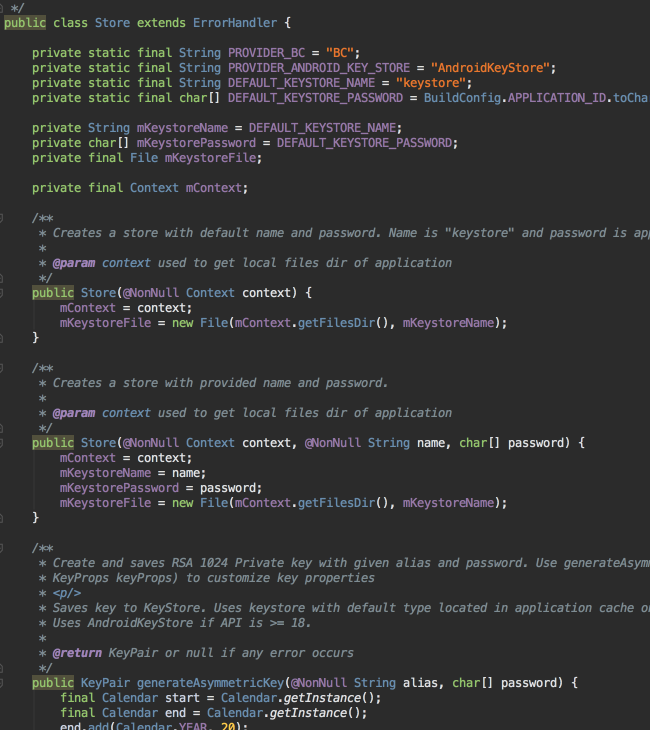
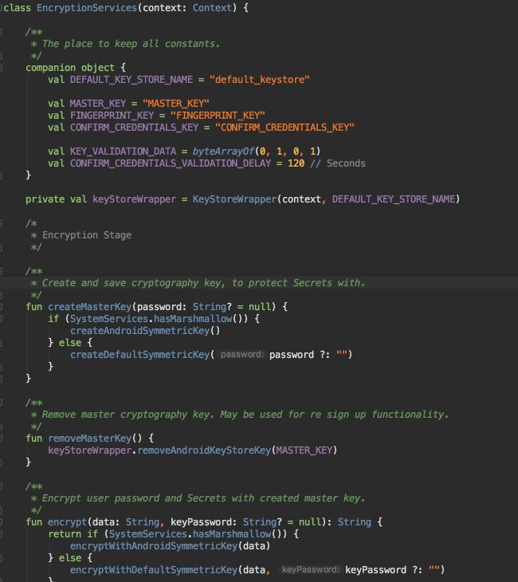
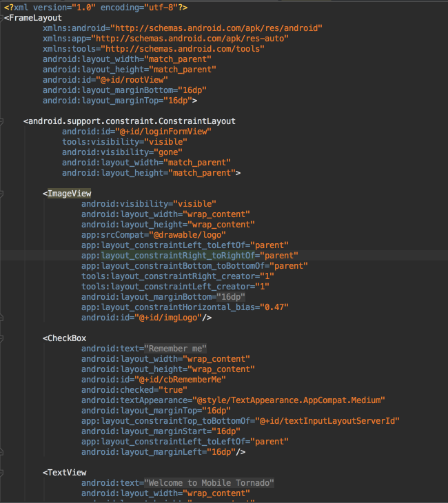

Obsidian with Darcula theme for IntelliJ IDEA / Android Studio. Based on [Obsidian](https://github.com/dmytrodanylyk/obsidian-colors) theme.

To import settings:

- Download [obsidian-darcula-v1.0.jar](obsidian-darcula-v1.0.jar)
- Open *IntelliJ IDEA* and go to *File -> Import Settings..*
- Select [obsidian-darcula-v1.0.jar](obsidian-darcula-v1.0.jar) and press *OK*

To apply settings:

- Open *IntelliJ IDEA* and go to *File -> Settings.. -> Editor -> Colors & Fonts*
- From *Schema* drop down select *Obisidan with Darcula* and press *OK*

### JAVA

### KOTLIN

### XML

